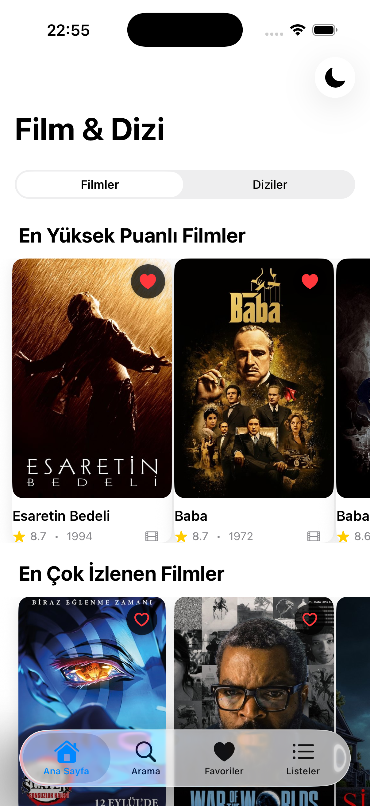
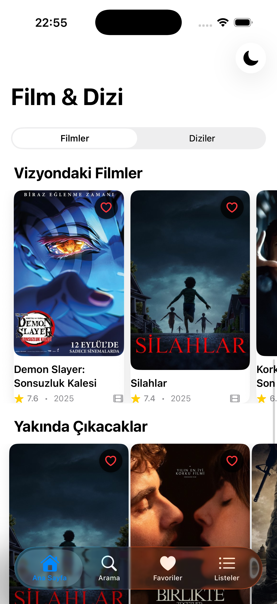
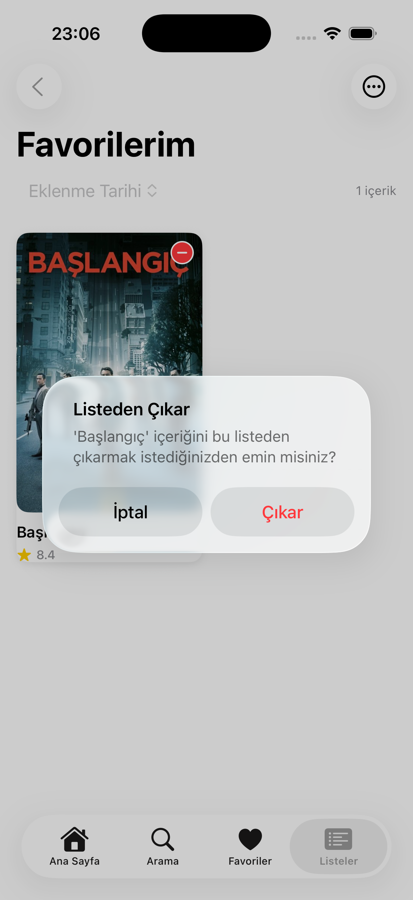
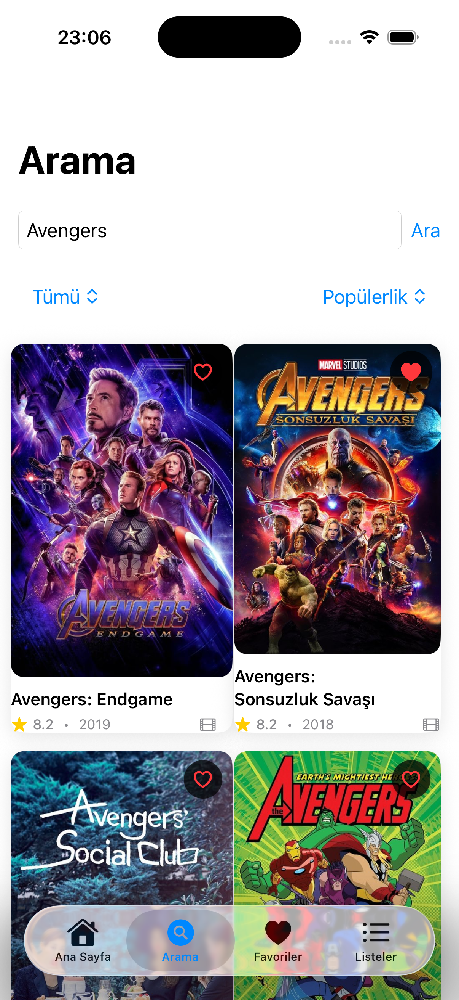
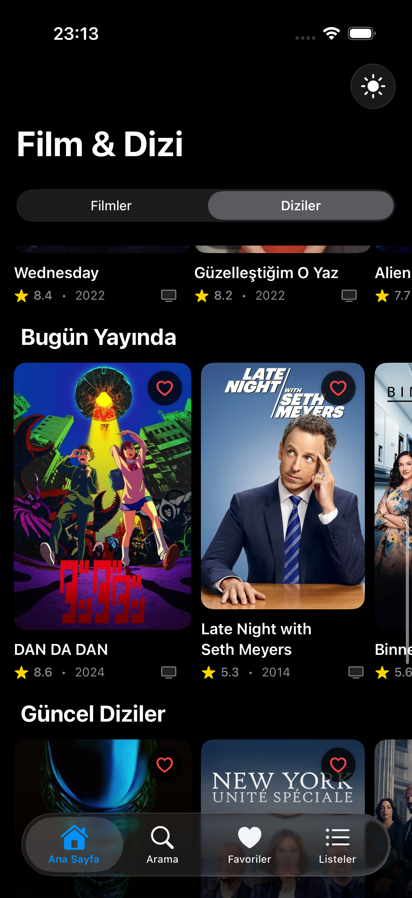

# 🎬 TV Series & Movies App

<div align="center">
  
  
  <br>
  
  
  
</div>

<br>

SwiftUI ile tasarlanmış modern bir film ve dizi keşif uygulaması. **The Movie Database (TMDB)** API'sini kullanarak binlerce film, dizi ve oyuncu bilgisine erişim sağlar.

---

## ✨ Öne Çıkan Özellikler

<table>
<tr>
<td width="50%">

### 🎯 **İçerik Keşfi**
- **Gündemde Olanlar** - En popüler film ve diziler
- **Yüksek Puanlılar** - Kritik ve izleyici favorileri  
- **Vizyondakiler** - Güncel sinema filmleri
- **Yakında Çıkacaklar** - Gelecek yapımlar
- **Kişisel Öneriler** - Size özel içerikler

</td>
<td width="50%">

### 🔍 **Gelişmiş Arama**
- **Akıllı Filtreleme** - Film, dizi, oyuncu arama
- **Çoklu Kategori** - Tür ve dil seçenekleri
- **Sıralama** - Puan, tarih, popülerlik
- **Oyuncu Detayları** - Biyografi ve filmografi
- **Anında Sonuç** - Hızlı arama algoritması

</td>
</tr>
</table>

### 💖 **Kişisel Deneyim**

| Özellik | Açıklama |
|---------|----------|
| **🎭 Favoriler** | Tek tıkla favori ekleme/çıkarma |
| **📋 Özel Listeler** | İzleyeceklerim, İzlediklerim gibi listeler |
| **🖼️ Özel Kapaklar** | Favoriler için kendi fotoğraflarınızı ekleyin |
| **🌙 Tema Desteği** | Koyu/Açık mod otomatik geçişi |

---

## 📱 Ekran Görüntüleri

### ☀️ Aydınlık Tema

<div align="center">
  <table>
    <tr>
      <td align="center">
        
        <br><strong>🏠 <br> Ana Sayfa <br> Gündemde </strong>
      </td>
      <td align="center">
        
        <br><strong>🏠 <br> Ana Sayfa <br> En Yüksek Puanlı Filmler </strong>
      </td>
      <td align="center">
        
        <br><strong>🏠 <br> Ana Sayfa <br> En Çok İzlenen Filmler </strong>
      </td>
      <td align="center">
        
        <br><strong>🏠 <br> Ana Sayfa <br> Vizyondaki Filmler </strong>
      </td>
      <td align="center">
        
        <br><strong>🏠 <br> Ana Sayfa <br> Yakında Çıkacaklar </strong>
      </td>
      <td align="center">
        
        <br><strong>🏠 <br> Ana Sayfa <br> Sizin İçin Önerilen </strong>
      </td>
    </tr>
    <tr>
      <td align="center">
        
        <br><strong>🎞️ <br> Film Detayı </strong>
      </td>
      <td align="center">
        
        <br><strong>🎞️ <br> Film Detayı </strong>
      </td>
      <td align="center">
        
        <br><strong>🎭 <br> Oyuncu Detayı </strong>
      </td>
      <td align="center">
        
        <br><strong>🎭 <br> Oyuncu Detayı </strong>
      </td>
      <td align="center">
        
        <br><strong>💖 <br> Favorilere Ekle </strong>
      </td>
      <td align="center">
        
        <br><strong>💖 <br> Favoriler </strong>
      </td>
    </tr>
    <tr>
      <td align="center">
        
        <br><strong>📌 <br> Liste Seçici</strong>
      </td>
      <td align="center">
        
        <br><strong>➕ <br> Liste Oluştur</strong>
      </td>
      <td align="center">
        
        <br><strong>✅ <br> Eklenen Liste </strong>
      </td>
      <td align="center">
        
        <br><strong>▶️ <br> Fragman </strong>
      </td>
      <td align="center">
        
        <br><strong>📋 <br> Listeler</strong>
      </td>
      <td align="center">
        
        <br><strong>➖ <br> Listeden Çıkarma </strong>
      </td>
    </tr>
    <tr>
      <td align="center">
        
        <br><strong>🎬 <br> Listeyi Silme/Düzeltme </strong>
      </td>
      <td align="center">
        
        <br><strong>🔍 <br> Arama </strong>
      </td>
      <td align="center">
        
        <br><strong>🔎 <br> Arama Sonuçları </strong>
      </td>
    </tr>
  </table>
</div>

### 🌙 Karanlık Tema

<div align="center">
  <table>
    <tr>
      <td align="center">
        
        <br><strong>🏠 <br> Ana Sayfa <br> Gündemde </strong>
      </td>
      <td align="center">
        
        <br><strong>🏠 <br> Ana Sayfa <br> En Yüksek Puanlı Diziler </strong>
      </td>
      <td align="center">
        
        <br><strong>🏠 <br> Ana Sayfa <br> En Çok İzlenen Diziler </strong>
      </td>
      <td align="center">
        
        <br><strong>🏠 <br> Ana Sayfa <br> Bugün Yayında </strong>
      </td>
      <td align="center">
        
        <br><strong>🏠 <br> Ana Sayfa <br> Güncel Diziler </strong>
      </td>
      <td align="center">
        
        <br><strong>🏠 <br> Ana Sayfa <br> Sizin İçin Önerilen </strong>
      </td>
    </tr>
    <tr>
      <td align="center">
        
        <br><strong>📺 <br> Dizi Detayı </strong>
      </td>
      <td align="center">
        
        <br><strong>📺 <br> Dizi Detayı </strong>
      </td>
      <td align="center">
        
        <br><strong>🎭 <br> Oyuncu Detayı </strong>
      </td>
      <td align="center">
        
        <br><strong>💖 <br> Favorilere Ekle </strong>
      </td>
      <td align="center">
        
        <br><strong>💖 <br> Favoriler </strong>
      </td>
      <td align="center">
        
        <br><strong>▶️ <br> Fragman </strong>
      </td>
    </tr>
    <tr>
      <td align="center">
        
        <br><strong>✅ <br> Eklenen Liste </strong>
      </td>
      <td align="center">
        
        <br><strong>📋 <br> Listeler</strong>
      </td>
      <td align="center">
        
        <br><strong>📋 <br> Liste Detay </strong>
      </td>
      <td align="center">
        
        <br><strong>🔍 <br> Arama </strong>
      </td>
      <td align="center">
        
        <br><strong>🔎 <br> Arama Sonuçları </strong>
      </td>
    </tr>
  </table>
</div>

### 🎨 Tema Desteği
Uygulama hem açık hem de koyu tema destekler ve sistem teması ile otomatik olarak senkronize olur.

---

## 🛠️ Teknik Özellikler

<div align="center">

| Kategori | Teknoloji |
|----------|-----------|
| **🏗️ Mimari** | MVVM + Combine |
| **🎨 UI Framework** | SwiftUI + NavigationStack |
| **🌐 Networking** | Async/Await + URLSession |
| **💾 Veri Saklama** | UserDefaults + JSON Encoding |
| **🖼️ Görsel İşleme** | AsyncImage + Custom Caching |
| **⚡ Performans** | LazyVGrid + Pull-to-Refresh |

</div>

### 🔄 **API Entegrasyonu**

```
📡 TMDB API Endpoints:
├── 🔥 /trending/{media_type}/day     → Gündemde olanlar
├── ⭐ /movie|tv/top_rated             → En yüksek puanlılar  
├── 👥 /movie|tv/popular               → En popüler içerik
├── 🎭 /search/person                  → Oyuncu arama
├── 🔍 /search/multi                   → Genel arama
├── 📺 /{media_type}/{id}/videos       → Fragmanlar
└── 👤 /{media_type}/{id}/credits      → Oyuncu kadrosu
```

---

## 📂 Proje Yapısı

```
📦 TVSeries&MoviesApp
├── 🏛️ Models/                    # Veri modelleri
│   ├── Movie.swift              # Film/dizi modeli
│   ├── Actor.swift              # Oyuncu modeli  
│   ├── FavoriteItem.swift       # Favori öğe modeli
│   └── CustomList.swift         # Özel liste modeli
├── 🔧 Services/                 # Servis katmanı
│   └── TMDBService.swift        # API servis yöneticisi
├── 🧠 ViewModels/               # İş mantığı
│   └── UserPreferences.swift    # Kullanıcı tercihleri
├── 🎨 Views/                    # Ekranlar
│   ├── ContentView.swift        # Ana tab görünümü
│   ├── HomeView.swift           # Ana sayfa
│   ├── SearchView.swift         # Arama sayfası
│   ├── FavoritesView.swift      # Favoriler
│   ├── ListsView.swift          # Özel listeler
│   ├── MovieDetailView.swift    # Film detayı
│   └── ActorDetailView.swift    # Oyuncu detayı
└── 🧩 Components/               # Yeniden kullanılabilir bileşenler
    ├── MovieCardView.swift      # Film kartı
    └── FavoriteCardView.swift   # Favori kartı
```

---

## 📚 Kullanım Rehberi

### **🏠 Ana Sayfa**
1. Film/Dizi seçicisini kullanarak içerik türünü değiştirin
2. Kategorileri kaydırarak farklı içerik gruplarını keşfedin
3. Aşağı çekerek içeriği yenileyin

### **🔍 Arama**
1. Arama kutusuna film, dizi veya oyuncu adı yazın
2. Filtre menüsünden medya türünü seçin
3. Sıralama seçenekleriyle sonuçları düzenleyin

### **💖 Favoriler**
1. Herhangi bir içerikte kalp ikonuna dokunun
2. Favoriler sekmesinde tüm favori içeriklerinizi görün
3. Özel kapak fotoğrafı eklemek için "..." menüsünü kullanın

### **📋 Listeler**
1. "+" butonu ile yeni liste oluşturun
2. Favoriler veya detay sayfalarından listeye içerik ekleyin
3. Liste adlarını düzenleyin ve içerik yönetin

---

## 🎯 Gelecek Özellikler

<div align="center">

| Özellik | Durum | Açıklama |
|---------|-------|----------|
| 🌐 **Çevrimdışı Mod** | 🔄 Planlanıyor | Favori içerikleri çevrimdışı görüntüleme |
| 📊 **İstatistikler** | 🔄 Planlanıyor | İzleme alışkanlıkları ve grafikler |
| 🎮 **Widget Desteği** | 🔄 Planlanıyor | Ana ekran widget'ları |
| 📺 **Apple TV App** | 🔄 Planlanıyor | tvOS desteği |
| 🔔 **Bildirimler** | 🔄 Planlanıyor | Yeni bölüm/film bildirimleri |

</div>

---

## ⚠️ Bilinen Sınırlamalar

- **İnternet Bağımlılığı**: Çevrimdışı kullanım sınırlı
- **API Rate Limiting**: Çok hızlı arama yaparken gecikmeler olabilir
- **Görsel Yükleme**: Yavaş internet bağlantısında görseller geç yüklenebilir

---

## 🔗 Faydalı Bağlantılar

<div align="center">
  <a href="https://www.themoviedb.org/" target="_blank">
    
  </a>
  <a href="https://developer.apple.com/xcode/" target="_blank">
    
  </a>
  <a href="https://swift.org/" target="_blank">
    
  </a>
</div>

---

## 📞 İletişim

Sorularınız için bana ulaşabilirsiniz:

<div align="center">
  <a href="mailto:baranhuseyinkencu@gmail.com" target="_blank">
    
  </a>
  <a href="https://github.com/HsynBrnQuenjou" target="_blank">
    
  </a>
</div>

---

<div align="center">
  <sub>🎬 Film ve dizi tutkunları için tasarlandı • TMDB verilerini kullanır • Eğitim amaçlıdır</sub>
</div>
